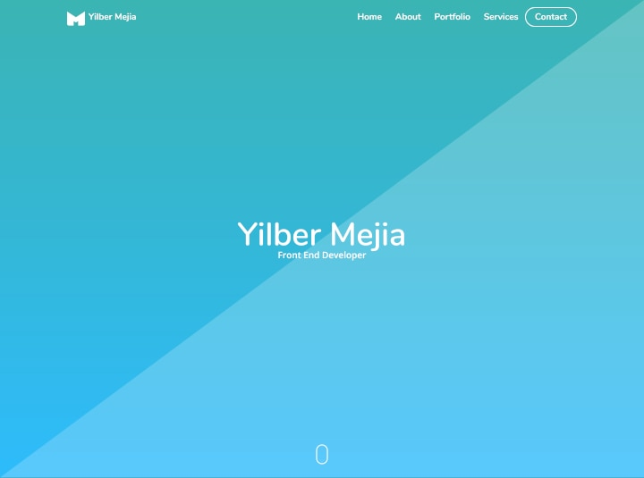

<h1 align="center">
  
   
  Project Name
   
</h1>

<h4 align="center">Project's description on the package.json file</h4>

  <a href="http://www.example.com"><strong>Website</strong></a> | <a href="http://www.example.com"><strong>Documentation</strong></a> | <a href="http://www.example.com"><strong>Download</strong></a>

  
  
  
  
  

  

